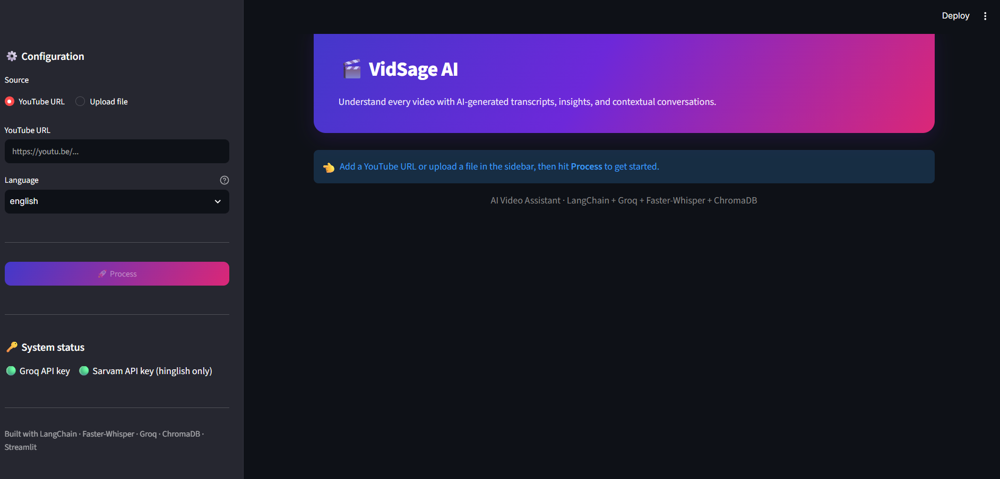
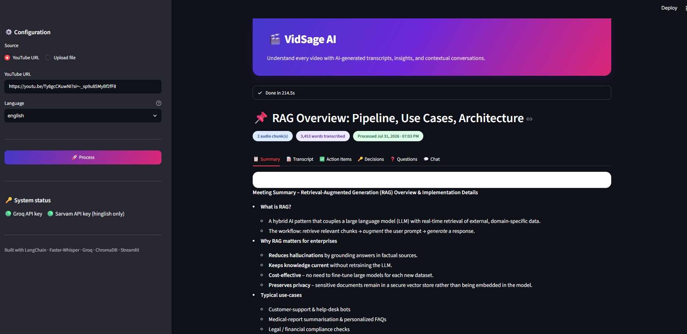
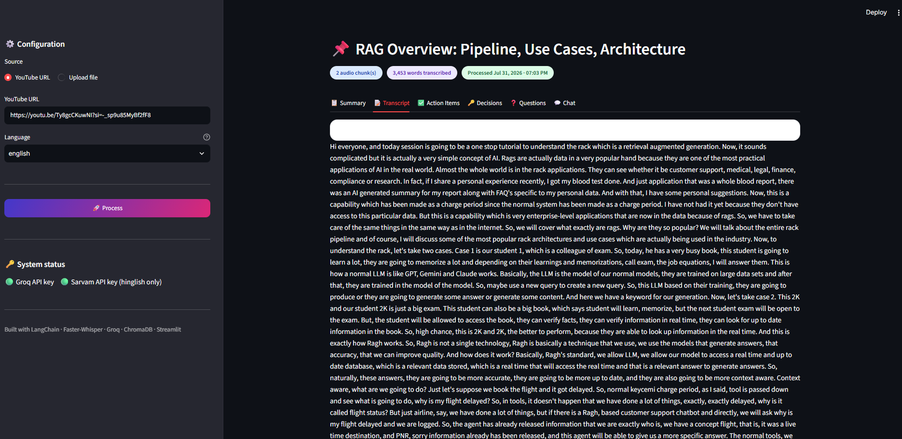
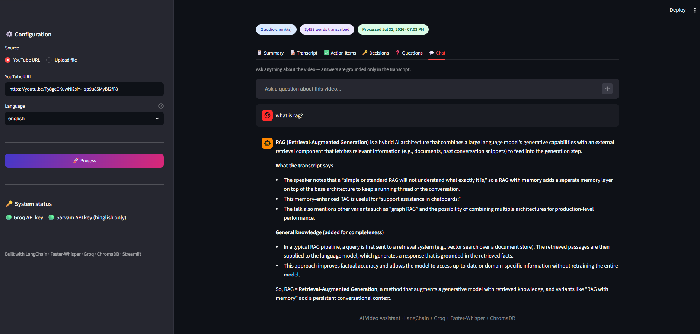

# 🎬 VidSage AI

> **AI-powered Video Intelligence Platform** that transforms YouTube videos, lectures, and meetings into searchable transcripts, AI-generated summaries, action items, and contextual conversations using Hybrid RAG.

<p align="center">
  
</p>

<p align="center">


</p>

---

# 📖 Overview

VidSage AI is an intelligent video assistant that helps users extract valuable insights from YouTube videos, online lectures, podcasts, webinars, and recorded meetings.

Instead of spending hours watching long videos, users can instantly:

- 📝 Generate accurate transcripts
- 📄 Produce concise AI summaries
- ✅ Extract action items
- 🔑 Identify important decisions
- ❓ Ask natural language questions about the video
- 🤖 Chat with an AI assistant powered by Hybrid RAG and Groq

The application combines semantic search with Retrieval-Augmented Generation (RAG) to provide transcript-grounded answers while seamlessly falling back to the LLM's general knowledge when appropriate.

---

# ✨ Features

### 🎥 Video Processing

- Download videos directly from YouTube
- Automatic audio extraction
- Audio preprocessing and chunking
- Fast speech-to-text transcription using Faster-Whisper

### 🌍 Multilingual Support

- Hindi → English translation
- English transcript generation

### 🧠 AI Analysis

- Executive summary
- Key highlights
- Important decisions
- Action items
- Open questions

### 💬 Hybrid RAG Chat

- Transcript-aware conversational AI
- Semantic search using ChromaDB
- Contextual question answering
- Falls back to Groq for general knowledge
- Natural conversational responses

### ⚡ Modern Interface

- Responsive Streamlit UI
- Dark mode design
- Interactive chat interface
- Organized dashboard

---

# 📸 Application Screenshots

## 🏠 Home Page


---

## 📄 AI Summary



---

## 📜 Transcript



---

## 💬 AI Chat



---

# 🏗️ System Architecture

```text
                    YouTube Video
                          │
                          ▼
                  Audio Extraction
                          │
                          ▼
                 Audio Preprocessing
                          │
                          ▼
                 Faster-Whisper STT
                          │
                          ▼
                     Transcript
                          │
          ┌───────────────┴───────────────┐
          ▼                               ▼
   AI Summarization               Text Chunking
                                          │
                                          ▼
                             HuggingFace Embeddings
                                          │
                                          ▼
                                    ChromaDB
                                          │
                                          ▼
                                    Hybrid RAG
                                          │
                                          ▼
                                     Groq LLM
                                          │
                                          ▼
                 Summary • Chat • Decisions • Action Items
```

---

# 🛠️ Tech Stack

| Category | Technology |
|-----------|------------|
| Language | Python |
| Frontend | Streamlit |
| LLM | Groq (GPT-OSS) |
| AI Framework | LangChain |
| Speech Recognition | Faster-Whisper |
| Vector Database | ChromaDB |
| Embeddings | HuggingFace Sentence Transformers |
| Video Download | yt-dlp |
| Audio Processing | pydub |
| Translation | Transformers |

---

# 📂 Project Structure

```text
VidSage_AI/
│
├── assets/
│   ├── home.png
│   ├── summary.png
│   ├── transcript.png
│   └── chat.png
│
├── core/
│   ├── extractor.py
│   ├── llm.py
│   ├── prompts.py
│   ├── RAG_Engine.py
│   ├── summarize.py
│   ├── transcriber.py
│   └── vector_stores.py
│
├── utils/
│   └── audio_processor.py
│
├── app.py
├── main.py
├── requirements.txt
├── README.md
└── .gitignore
```

---

# ⚙️ Installation

Clone the repository

```bash
git clone https://github.com/Ujjvl-hub/VidSage_AI.git
```

Navigate into the project

```bash
cd VidSage_AI
```

Create a virtual environment

```bash
python -m venv .venv
```

Activate it

### Windows

```bash
.venv\Scripts\activate
```

### Linux / macOS

```bash
source .venv/bin/activate
```

Install dependencies

```bash
pip install -r requirements.txt
```

---

# 🔑 Environment Variables

Create a `.env` file in the project root.

```env
GROQ_API_KEY=your_groq_api_key
```

---

# ▶️ Run the Application

```bash
streamlit run app.py
```

---

# 💡 Future Improvements

- Streaming LLM responses
- Chat history memory
- PDF export
- Speaker diarization
- Multi-video knowledge base
- Voice interaction
- Cloud storage integration
- Multi-language summarization

---

# 🤝 Contributing

Contributions are welcome!

If you have ideas for improvements or find any issues, feel free to open an issue or submit a pull request.

---

# 📜 License

This project is licensed under the **MIT License**.

---

# 👨‍💻 Developer

**Ujjwal Kumar**

- 💼 LinkedIn: https://www.linkedin.com/in/ujjwal-kumar-8a4b66310/
- 💻 GitHub: https://github.com/Ujjvl-hub

---

## ⭐ Support

If you found this project useful, please consider giving it a ⭐ on GitHub. It helps others discover the project and motivates future improvements.